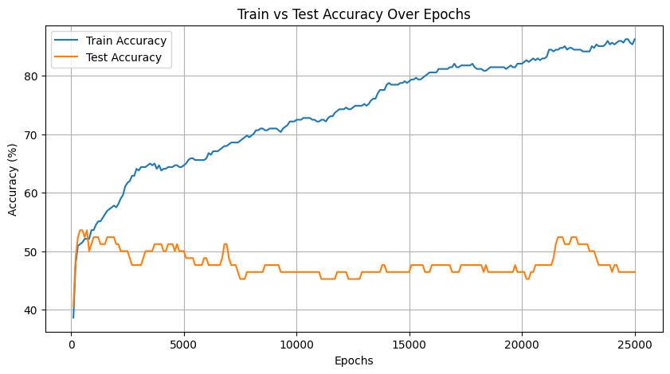
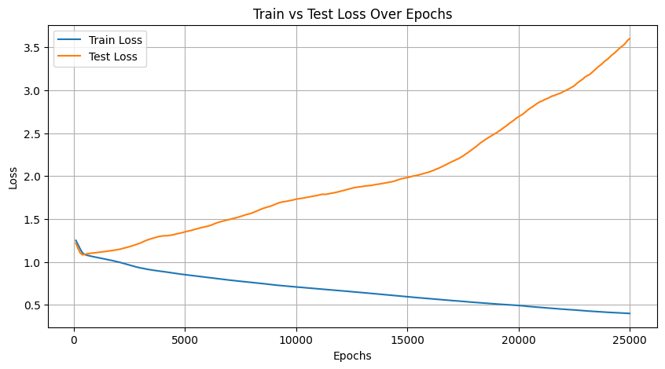
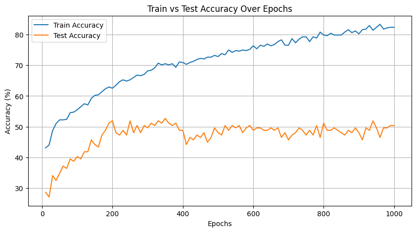
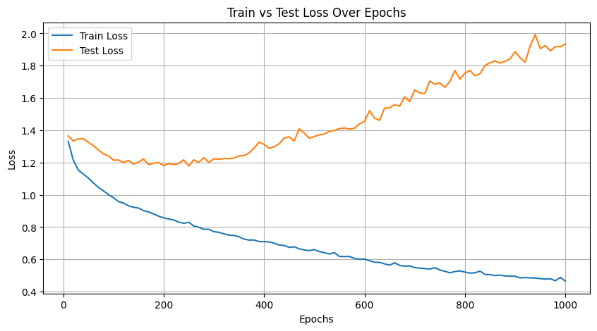
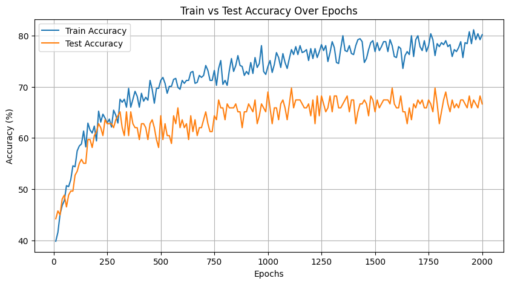
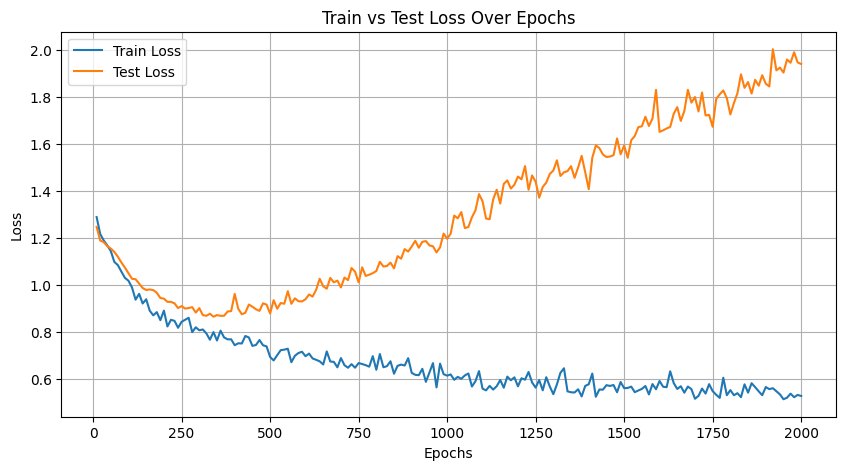

# Cirrhosis Prediction Using Neural Networks

## Project Overview

In this project I have developed a predictive model to classify cirrhosis into four
categories using a neural network built with PyTorch.

I'm using the [Cirrhosis Prediction Dataset](https://www.kaggle.com/datasets/fedesoriano/cirrhosis-prediction-dataset/data).

## What is Cirrhosis?

Cirrhosis is a chronic liver disease characterized by scarring (fibrosis) of the
liver tissue, leading to impaired liver function. Commonly caused by long-term
liver damage from factors like alcohol abuse, hepatitis, and fatty liver
disease, cirrhosis can progress to life-threatening complications if left
untreated. Early detection and classification of cirrhosis stages are essential
for timely intervention and management.

## Approach

- **Model Development**: Two neural network models will be implemented:
  - **Neural Network from Scratch**: Built from scratch using only NumPy to
    understand the fundamental workings of each network component.
  - **PyTorch Neural Network**: Developed with PyTorch to leverage its deep
    learning capabilities and optimized operations.
- **Comparison**: The performance of the handwritten model will be compared
  against the PyTorch implementation to evaluate accuracy, efficiency, and
  computational complexity.

## Files

### Random Forest

- [Random Forest with 275 estimators](./random_forest.ipynb)   
=> accuracy = 44%

### Neural Network using Pytorch

- [Neural Network with Gradient Descent](./cirrhosis_prediction_pytorch_gd.ipynb)
- [Neural Network with Stochastic Gradient Descent](./cirrhosis_prediction_pytorch_batch_sgd.ipynb)
- [Neural Network with Stochastic Gradient Descent and Dropout Layers](./cirrhosis_prediction_pytorch_sgd_and_dropout.ipynb)

#### Plots for Neural Network with Gradient Descent

#### Plots for Neural Network with Stochastic Gradient Descent

#### Plots for Neural Network with Stochastic Gradient Descent and Dropout Layers

