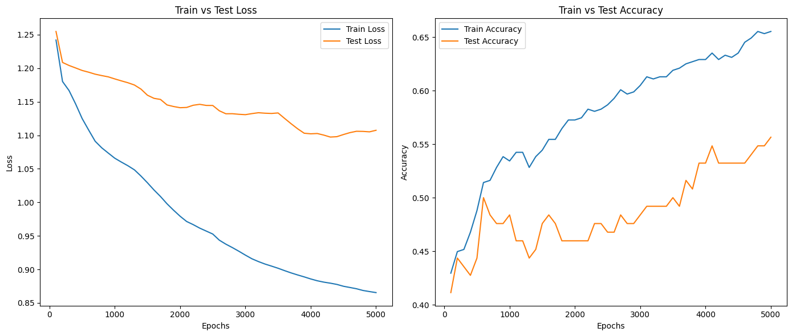
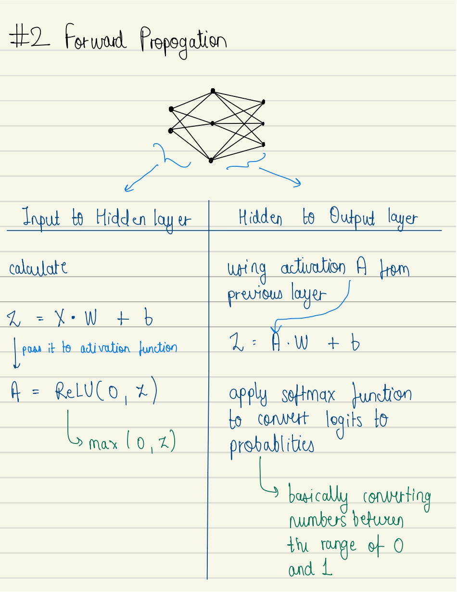
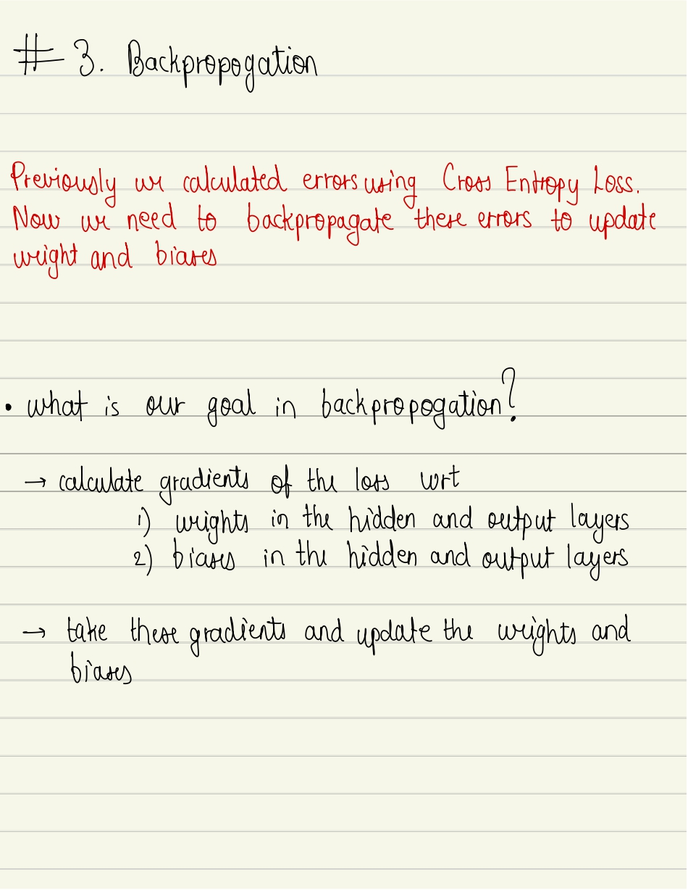

# Cirrhosis Prediction Using Neural Networks

## Table of Content

- [Cirrhosis Prediction Using Neural Networks](#cirrhosis-prediction-using-neural-networks)
  - [Table of Content](#table-of-content)
  - [Overview](#overview)
    - [What is Cirrhosis?](#what-is-cirrhosis)
  - [Files](#files)
    - [Neural Network From Scratch](#neural-network-from-scratch)
    - [Neural Network using Pytorch](#neural-network-using-pytorch)
    - [Random Forest Implementation](#random-forest-implementation)
  - [Notes on how neural network works (from scratch)](#notes-on-how-neural-network-works-from-scratch)
  - [Extra](#extra)

## Overview

In this project I have developed a predictive model to classify cirrhosis into
four categories using a neural network built with PyTorch.

I'm using the
[Cirrhosis Prediction Dataset](https://www.kaggle.com/datasets/fedesoriano/cirrhosis-prediction-dataset/data).

### What is Cirrhosis?

Cirrhosis is a chronic liver disease characterized by scarring (fibrosis) of the
liver tissue, leading to impaired liver function.  
Commonly caused by long-term liver damage from factors like alcohol abuse,
hepatitis, and fatty liver disease  
Early detection and classification of cirrhosis stages are essential for timely
intervention.

_credits to respective owner of the image_

## Files

### Neural Network From Scratch

The files for this section includes complete data preprocessing

1. Drop columns with excessive missing values
2. Fill rows with missing values
3. Data Mapping
4. Handle Outliers
5. Normalizing the data
6. OverSampling with SMOTE

[Shallow Neural Network using Numpy only](./from_scratch_neural_network.ipynb)
=> accuracy = 56%

[Shallow Neural Network with update Hyperparameters](./from_scratch_neural_network_update_hparams.ipynb)  
=> **accuracy = 66%**

-> Updated Hyerparameters and also the size of hidden layer
-> Broke down the backpropagation function into individual functions

### Neural Network using Pytorch

[Neural Network with Gradient Descent](./cirrhosis_prediction_pytorch_gd.ipynb)

[Neural Network with Stochastic Gradient Descent](./cirrhosis_prediction_pytorch_batch_sgd.ipynb)

[Neural Network with Stochastic Gradient Descent and Dropout Layers](./cirrhosis_prediction_pytorch_sgd_and_dropout.ipynb)

### Random Forest Implementation

[Random Forest with 275 estimators](./random_forest.ipynb) => accuracy = 44%

## Notes on how neural network works (from scratch)

[Download the whole PDF](NOTES.pdf)

## Extra

Open an issue if there are any improvements or errors in code and notes.

⭐ The repository if you like the notes and appraoch
